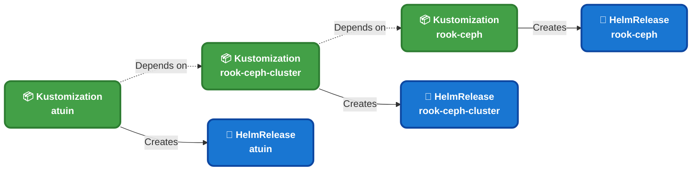

<div align="center">


### My home Infra Repo 

_... managed with [Flux](https://github.com/fluxcd/flux2), [Renovate](https://github.com/renovatebot/renovate), and [GitHub Actions](https://github.com/features/actions)_ 

</div>

<div align="center">

[](https://status.monosense.io)&nbsp;&nbsp;
[](https://status.monosense.io)&nbsp;&nbsp;
[](https://status.monosense.io)

</div>

<div align="center">

[](https://discord.gg/home-operations)&nbsp;&nbsp;
[](https://talos.dev)&nbsp;&nbsp;
[](https://kubernetes.io)&nbsp;&nbsp;
[](https://fluxcd.io)&nbsp;&nbsp;
[](https://github.com/buroa/k8s-gitops/actions/workflows/renovate.yaml)

</div>

<div align="center">

[](https://github.com/home-operations/kromgo)&nbsp;&nbsp;
[](https://github.com/home-operations/kromgo)&nbsp;&nbsp;
[](https://github.com/home-operations/kromgo)&nbsp;&nbsp;
[](https://github.com/home-operations/kromgo)&nbsp;&nbsp;
[](https://github.com/home-operations/kromgo)&nbsp;&nbsp;
[](https://github.com/home-operations/kromgo)&nbsp;&nbsp;
[](https://github.com/home-operations/kromgo)&nbsp;&nbsp;
[](https://github.com/home-operations/kromgo)

</div>

---

##  Overview

This repository is the single source of truth for my home Kubernetes cluster and the workloads that run on it. Every cluster resource — from the operating system layer down to individual application Helm releases — is declared as code and reconciled automatically.

The stack is intentionally boring and reproducible:

- [Talos Linux](https://github.com/siderolabs/talos) — Immutable, API-driven OS that runs nothing but Kubernetes.
- [Flux](https://github.com/fluxcd/flux2) — Continuous reconciliation of cluster state against this repository.
- [Renovate](https://github.com/renovatebot/renovate) — Automated dependency updates across the entire cluster.
- [GitHub Actions](https://github.com/features/actions) — Validation and automation on every commit.

Disaster recovery is built in. Wipe every disk in the rack. Minutes later, the cluster is back — applications running, persistent data intact, zero manual steps. It picks up exactly where it left off.

Want to build something similar? Start with [onedr0p/cluster-template](https://github.com/onedr0p/cluster-template).

---

##  Repository Layout

```sh
📁 bootstrap     # One-time cluster bootstrap (helmfile + kustomize)
📁 kubernetes    # Everything Flux reconciles
├─📁 apps        # Workloads, grouped by namespace
├─📁 components  # Reusable Kustomize components (alerts, kopiur, etc.)
└─📁 flux        # Flux system configuration and source repositories
📁 talos         # Talos machine configs and per-node overrides
```

---

##  Cluster

A semi hyper-converged, three-node Kubernetes cluster running on bare-metal [MS-A2](https://store.minisforum.com/products/minisforum-ms-a2) workstations. Persistent storage lives inside the cluster via [Rook Ceph](https://github.com/rook/rook), with bulk media offloaded to a dedicated TrueNAS box over NFS.

### Core components

- [actions-runner-controller](https://github.com/actions/actions-runner-controller) — Self-hosted GitHub runners for CI/CD workflows.
- [cert-manager](https://github.com/cert-manager/cert-manager) — Automated SSL certificate management and provisioning.
- [cilium](https://github.com/cilium/cilium) — High-performance container networking powered by [eBPF](https://ebpf.io).
- [cloudflared](https://github.com/cloudflare/cloudflared) — Secure tunnel providing Cloudflare-protected access to cluster services.
- [envoy-gateway](https://github.com/envoyproxy/gateway) — Modern ingress controller for cluster traffic management.
- [external-dns](https://github.com/kubernetes-sigs/external-dns) — Automated DNS record synchronization for ingress resources.
- [external-secrets](https://github.com/external-secrets/external-secrets) — Kubernetes secrets management integrated with [1Password](https://1password.com).
- [fluent-bit](https://github.com/fluent/fluent-bit) — Node-level Kubernetes log collection and forwarding.
- [grafana-operator](https://github.com/grafana/grafana-operator) — Declarative Grafana instances, datasources, and dashboards.
- [kopiur](https://github.com/home-operations/kopiur) — Advanced backup and recovery solution for persistent volume claims.
- [multus](https://github.com/k8snetworkplumbingwg/multus-cni) — Multi-homed pod networking for advanced network configurations.
- [rook](https://github.com/rook/rook) — Cloud-native distributed storage orchestrator for persistent storage.
- [spegel](https://github.com/spegel-org/spegel) — Stateless cluster-local OCI registry mirror for improved performance.
- [VictoriaLogs](https://github.com/VictoriaMetrics/VictoriaLogs) — Persistent Kubernetes log storage and LogsQL search.
- [VictoriaMetrics](https://github.com/VictoriaMetrics/VictoriaMetrics) — Metrics ingestion, storage, querying, recording rules, and alerting.

### GitOps workflow

Flux watches the [kubernetes](./kubernetes) directory and reconciles the cluster on every commit. The flow is:

1. Flux recursively scans [kubernetes/apps](./kubernetes/apps) and reads each top-level `kustomization.yaml`.
2. Those entrypoints typically declare a `Namespace` and one or more Flux `Kustomization` resources (`ks.yaml`).
3. Each Flux `Kustomization` materializes a `HelmRelease` (or raw manifests) for an application.
4. Flux applies them in dependency order — e.g. nothing in `rook-ceph` deploys until its prerequisites are healthy.



---

##  Networking

A multi-tier home network built on mixed `Juniper` and `TP-Link` Omada hardware. `Juniper SRX1500` handles routing and firewall between my dual WAN and the LAN. Two `TP-Link SX3008F` act as ToR switches forms the backbone — bonded to my Container services, NAS, Kubernetes nodes at 10G LACP — while a 10-port `TP-Link SG2210MP` PoE+ switch fans out to `TP-Link EAP653` and `EAP613` wireless access points.

```mermaid
graph LR
    %% Class Definitions
    classDef wan fill:#f87171,stroke:#fff,stroke-width:2px,color:#fff,font-weight:bold;
    classDef core fill:#60a5fa,stroke:#fff,stroke-width:2px,color:#fff,font-weight:bold;
    classDef agg fill:#34d399,stroke:#fff,stroke-width:2px,color:#fff,font-weight:bold;
    classDef switch fill:#a78bfa,stroke:#fff,stroke-width:2px,color:#fff,font-weight:bold;
    classDef device fill:#facc15,stroke:#fff,stroke-width:2px,color:#000,font-weight:bold;
    classDef vlan fill:#1f2937,stroke:#fff,stroke-width:1px,color:#fff,font-size:12px;

    %% Nodes
    WAN1[🛜 WAN1<br/>300Mbps WAN]:::wan
    WAN2[🛜 WAN2<br/>500Mbps WAN]:::wan
    UDM[📦 SRX1500]:::core
    AGG1[🔗 ToR1]:::agg
    AGG2[🔗 ToR2]:::agg
    NAS[💾 NAS]:::device
    K8s[☸️ Kubernetes<br/>5 Nodes]:::device
    SW[🔌 PoE SW]:::switch
    DEV[💻 Devices]:::device
    WIFI[📶 WiFi Clients]:::device

    %% Subgraph for VLANs
    subgraph VLANs [LAN +vlan]
        direction TB
        LOCAL[MGMT<br/>10.25.10.0/24]:::vlan
        TRUSTED[PROD*<br/>10.25.11.0/24]:::vlan
        SERVERS[HOME*<br/>10.25.12.0/24]:::vlan
        SERVICES[DEV*<br/>10.25.13.0/24]:::vlan
    end

    style VLANs fill:#111,stroke:#fff,stroke-width:2px,rx:0,ry:0,padding:20px;

    %% Links
    SERVERS -.-> WAN2
    WAN1 -.->|WAN| UDM
    WAN2 -.->|WAN| UDM
    UDM -- 10G --- AGG1
    UDM -- 10G --- AGG2
    UDM -- 1G LACP --- SW
    AGG1 -- 10G LACP --> K8s
    AGG2 -- 10G LACP --> K8s
    AGG1 -- 10G --> NAS
    AGG2 -- 10G --> NAS
    SW --> DEV
    SW --> WIFI

    %% Keep SERVERS->RCN as a hidden layout constraint and style bonded links thicker
    linkStyle 0 stroke:transparent,stroke-width:0px,color:transparent;
    linkStyle 2 stroke-width:4px;
    linkStyle 3 stroke-width:4px;
    linkStyle 4 stroke-width:2px;
    linkStyle 5 stroke-width:4px;
```



### DNS

The Kubernetes manifests define two ExternalDNS instances for future DNS automation:

- **Private** — The current manifest targets UniFi. It is not deployed and is not connected to
  PowerDNS.
- **Public** — The current manifest targets Cloudflare for routes on the `external` Gateway.

PowerDNS Authoritative currently runs independently on c0 at `10.25.13.33` with only static private
bootstrap records. AdGuard, Cloudflare, and Kubernetes remain unchanged; see
[`docs/POWERDNS.md`](docs/POWERDNS.md).

---

##  Hardware

<details>
  <summary>Click to see my rack</summary>

  
</details>

| Device                       | Count | OS Disk    | Data Disk                  | RAM   | OS            | Purpose              |
| ---------------------------- | ----- | ---------- | -------------------------- | ----- | ------------- | -------------------- |
| Lenovo M920x/P330             | 5     | 500GB SSD | 1TB M.2 + 512GB M.2    | 64GB  | Talos         | Kubernetes           |
| Lenovo M920x           | 1     | 500GB SSD | 1×1TB M.2 + 1x512GB M.2 | 64GB | Ubuntu 24.04 | NFS + S3 |
| Lenovo M910q             | 1     | 800GB SSD     | -                           | 32GB  | Fedora IoT       | Infra Services          |
| IBM Tape Library TS-3200      | 1     | -             | 24xLTO-6 + 24xLTO-7         | -     | -                | Longterm Archive        |
| TESmart 8 Port KVM Switch     | 1     | -             | -                           | -     | -                | Network KVM             |
| Juniper SRX1500    | 1     | -          | -                | -     | JunOS      | Router & Firewall         |
| TP-Link SX3008F    | 2     | -          | -                          | -     | -      | 10G ToR Switch     |
| TP-Link SG2210MP   | 1     | -          | -                          | -     | -      | 1G PoE+ Switch      |
| APC ATS Rack | 1     | -          | -                          | -     | -      | PDU                  |
| APC SURT2000RM XL + 2x BP        | 1     | -          | -                          | -     | -             | UPS                  |

### M920X/P330 build

Each M920X/P330 tiny-pc is equipped with:

- Intel Core i7 8700T, 64GB RAM, 1x1TB M.2 NVMe + 1x512GB M.2 NVMe
- Intel X710-DA2 10Gbps NIC

---

##  Thanks

A huge thank you to [Home Operations](https://discord.gg/home-operations) Discord community for the knowledge, patterns, and support that made this cluster possible. For more inspiration on running apps in a homelab, browse [kubesearch.dev](https://kubesearch.dev).

</div>
