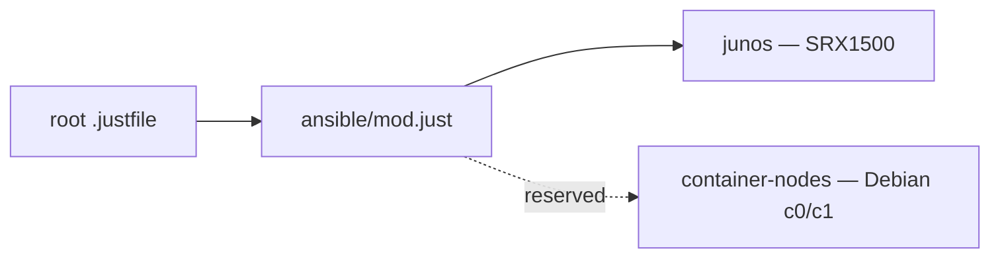

<div align="center">

# Ansible automation


</div>

`ansible/` is a shared command namespace, not a shared Ansible project. Every child owns its inventory, configuration, roles, collections, tests, runtime inputs, and local output.



## Project catalog

| Project | Status | Purpose | Guide |
|---|---|---|---|
| `junos` | Active, pre-adoption gate closed | Structured SRX1500 intent, safe NETCONF deployment, verification, drift, and encrypted backup | [Junos operator handbook](junos/README.md) |

| Projects may share | Projects must not share |
|---|---|
| Root mise configuration and lockfile | Inventory or host/group variables |
| `just ansible <project> <action>` grammar | `ansible.cfg` or Galaxy installation directory |
| CI hardening and public-safety conventions | Roles, playbooks, topology, secrets, or runtime state |
| Documentation conventions | Project-specific tests and operational evidence |

Junos ownership is intentionally split: `intent/` and `scripts/junos_intent.py`
own the reviewed candidate, `roles/junos_intent/` owns the one
`ANSIBLE_SRX1500` group lifecycle, and `scripts/with-openbao-runtime.sh` owns
ephemeral credential injection. Device-local recovery/authentication remains
outside this repository. The tracked `ansible/junos/adoption.yml` record is
currently false; the role, drift playbook, and runtime read it directly, and
no repository command mutates it. Manual adoption and parity review are
documented only in the Junos handbook.

## Command grammar

```console
just ansible <project> <action>
```

```console
just ansible junos bootstrap
just ansible junos test
just ansible junos render
```

The root exposes one `ansible` module. `ansible/mod.just` validates and dispatches project actions, so adding a project does not require a new root module or nested project `mod.just`.

## First-time setup

This repository supports mise, not Homebrew. Mise is the one bootstrap exception because it cannot install itself.

1. Download mise `v2026.8.11` from the [official release page](https://github.com/jdx/mise/releases/tag/v2026.8.11).
2. Verify the platform artifact against the release's signed `SHASUMS256.txt` before putting it on `PATH`.
3. Trust and install the repository toolchain:

   ```console
   mise --version
   mise trust
   mise install --locked
   just ansible junos bootstrap
   ```

The lock covers Apple Silicon macOS and x86-64 Linux. WSL2 uses Linux x86-64 artifacts and must run from its Linux filesystem. Native Windows is not a controller target.

Mise configuration contains no install hooks or credentials. All
version-sensitive third-party commands must resolve through mise.
Operating-system primitives such as Bash, `chmod`, `mktemp`, and either
`shasum` or `sha256sum` remain platform requirements.

### Public environment contract

Root `.mise.toml` is the canonical home for stable, non-secret environment
settings used across the repository:

| Variable | Purpose |
|---|---|
| `BAO_ADDR` | Public HTTPS endpoint for the existing network OpenBao service |
| `SOPS_AGE_KEY_FILE` | Cross-platform path to the user-owned SOPS age identity file |
| `KUBECONFIG` | Repository Kubernetes client configuration path |
| `TALOSCONFIG` | Repository Talos client configuration path |
| `FLATE_PATH` | Repository Flux source path |
| `MINIJINJA_CONFIG_FILE` | Repository template-engine configuration path |

Do not add tokens, private keys, passwords, real topology, decrypted values, or
temporary `JUNOS_*` variables to mise. Computed Talos values and manifest
substitution variables are per-command inputs, not global environment
configuration. This split keeps public configuration reproducible without
turning mise activation into secret distribution.

SOPS is a repository-level tool but is not part of Junos secret handling. Cross-platform identity setup is documented in [SOPS and age](../docs/SOPS.md).

## Adding a project

- Create `ansible/<project>/` with its own configuration, inventory, Galaxy manifest, roles, playbooks, tests, and ignored state.
- Add a validated branch to `ansible/mod.just`; do not add a nested Just module.
- Preserve `just ansible <project> <action>` as the public grammar.
- Never import Junos inventory, topology, OpenBao paths, roles, collections, or secrets.
- Use documentation-only fixtures for offline tests and CI.
- Run bootstrap, test, and lint through the same Just interface locally and in CI.
- Add the project to this catalog and write a project-specific operator guide.

Continue with the [Junos operator handbook](junos/README.md) for controller setup and operations.
