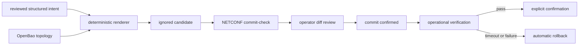
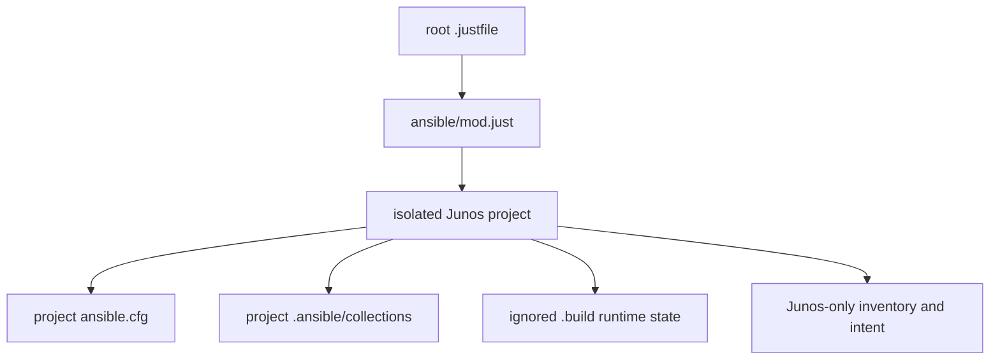
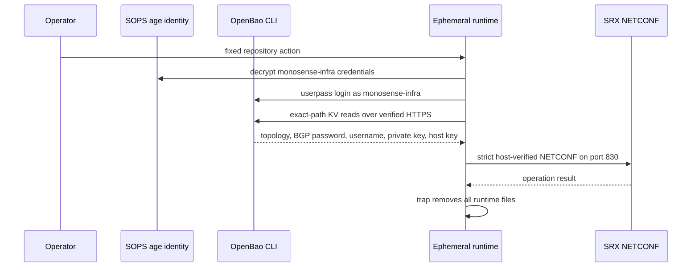

<div align="center">

# Junos SRX operator handbook


</div>

This project turns reviewed structured intent into a deterministic Junos candidate. OpenBao supplies real topology and NETCONF credentials; SOPS protects only the fixed service-authentication bootstrap. Live changes use verified NETCONF, commit-check, explicit diff review, and commit-confirmed deployment.

## Contents

- [Architecture and ownership](#architecture-and-ownership)
- [Toolchain](#toolchain)
- [Controller and service prerequisites](#controller-and-service-prerequisites)
- [First-time setup](#first-time-setup)
- [OpenBao contract](#openbao-contract)
- [Structured intent](#structured-intent)
- [Command safety](#command-safety)
- [Operational runbooks](#operational-runbooks)
- [Troubleshooting](#troubleshooting)
- [Repository safety and handoff](#repository-safety-and-handoff)

## Architecture and ownership



The role owns only the `ANSIBLE_SRX1500` configuration group and its `apply-groups` reference. Device-local recovery users, authentication, unmanaged groups, and generated/default state remain outside its boundary.



### Runtime secret flow



The repository does not enable OpenBao auth methods, apply policy, write KV data, create tokens, rotate credentials, or manage the Docker service.

### Repository map

| Path | Purpose |
|---|---|
| `ansible.cfg` | Strict SSH, project-local collections, ignored controller temp paths |
| `inventory/` | One isolated Junos inventory; no environment hierarchy is needed for this device |
| `inventory/{group_vars/junos,host_vars/srx1500}/` | Inventory-bound connection and identity controls; secrets arrive from OpenBao |
| `intent/srx1500/` | First-class seven-domain logical intent, not Ansible auto-loaded host variables |
| `roles/junos_intent/` | One coherent candidate renderer, identity gates, commit-check, and deployment lifecycle |
| `playbooks/` | Live, verification, confirmation, bounded drift, and backup workflows |
| `../requirements.yml` | Repository-wide exact Galaxy collection versions |
| `requirements-controller.in` and lock | Reviewed Python runtime and generated hashes |
| `scripts/` | Dispatch, OpenBao runtime, render, backup, and safety checks |
| `docker/c0/openbao/policies/junos-operator.hcl` | Sole deployable read-only OpenBao consumer policy |
| `.ansible/`, `.build/` | Ignored collections and protected transient candidates, diffs, summaries, and encrypted backups |

## Toolchain

| Component | Compatibility or reviewed version | Purpose |
|---|---:|---|
| mise | 2026.8.11 minimum | Tool activation and strict lock enforcement |
| Python | 3.13 | Controller runtime line |
| ansible-core | 2.21 | Deployment runtime line |
| juniper.device | 2.0.2 | Junos modules |
| ansible.netcommon | 8.6.1 | NETCONF connection support |
| junos-eznc | 2.8.2 | PyEZ runtime baseline |
| ncclient | 0.7.0 | Exact NETCONF transport required by junos-eznc 2.8.2 |
| jxmlease | 1.0.3 | Required legacy XML parser with a regression test |
| OpenBao CLI | 2.6.2 reviewed lock | KV consumer and session checks |
| age | 1.3.1 reviewed lock | Encrypted configuration backups |
| Gitleaks | 8.30.0 reviewed lock | Scanner accepted only after its canary succeeds |
| SRX / Junos | SRX1500 / `23.4R2` train | Live model and release gate |

`.mise.toml` selects compatibility lines; `mise.lock` owns exact artifacts, URLs, and checksums for macOS ARM64 and Linux x86-64. The ansible-core pipx environment receives a universal, hash-pinned controller requirements lock. Lint tools are isolated from that live environment. uv is only the resolver/installer used by mise and deliberate lock regeneration; it is not the workflow runner.

No global shell script duplicates every patch version. Preflight checks mise provenance, compatible release lines, imports, collection loading, and behavior. See [mise lockfiles](https://mise.jdx.dev/dev-tools/mise-lock.html), [mise pipx](https://mise.jdx.dev/dev-tools/backends/pipx.html), [Ansible support matrix](https://docs.ansible.com/projects/ansible/latest/reference_appendices/release_and_maintenance.html), and [Juniper requirements](https://github.com/Juniper/ansible-junos-stdlib).

## Controller and service prerequisites

The controller is Apple Silicon macOS, x86-64 Linux, or x86-64 WSL2 running the
repository from its Linux filesystem. It needs Bash, Git, `chmod`, `mktemp`, and
either `shasum` or `sha256sum`; mise supplies every version-sensitive
third-party CLI. Native Windows and WSL execution from `/mnt/c` are outside the
supported permission model.

Before a live command, all of these external prerequisites must already exist:

- DNS and a valid TLS chain for `vault.monosense.io`; use `BAO_CACERT` only if
  the service administrator supplies a private CA file. `BAO_SKIP_VERIFY`,
  `VAULT_SKIP_VERIFY`, and unreviewed TLS server-name overrides are prohibited
  and rejected before any OpenBao call.
- A real, non-symlink SOPS age identity at `SOPS_AGE_KEY_FILE` (default
  `~/.config/sops/age/keys.txt`) that can decrypt the tracked
  `encrypted/monosense-infra.env` service credentials. Routine commands reject
  pre-set `BAO_TOKEN` and `VAULT_TOKEN` values.
- A KV v2 engine mounted at `kv/`. An administrator can confirm the mount type
  and version with `bao secrets list -detailed` without reading Junos data.
- Network reachability from the trusted controller to the SRX NETCONF SSH
  service on TCP 830.
- An SRX1500 whose hostname is `srx1500` and whose release matches the anchored
  reviewed `23.4R2` train. Every live play rejects a different identity before commit.
- `system services netconf ssh` enabled and a dedicated, least-privilege Junos
  automation account with the matching SSH public key. Account and recovery
  configuration remain device-local and outside the managed group.
- The SRX SSH host public key verified through a trusted console or another
  independent administrative channel, plus an independent recovery path during
  deployment.

Juniper documents the required NETCONF service, account, and key setup in
[Establish an SSH connection for a NETCONF session](https://www.juniper.net/documentation/us/en/software/junos/netconf/topics/topic-map/netconf-ssh-connection.html).

## First-time setup

All steps through offline validation are locally testable on macOS, Linux, and WSL2. Live commands require network reachability to OpenBao and the SRX.

1. Install mise `v2026.8.11` from the
   [immutable official release](https://github.com/jdx/mise/releases/tag/v2026.8.11).
   Verify the archive against the release checksum and independently verify the
   signed release tag before putting the binary on `PATH`. This repository does
   not support Homebrew.
2. Trust and install the locked toolchain:

   ```console
   mise trust
   mise install --locked
   mise doctor
   ```

3. Install project-local Galaxy collections and run compatibility smoke tests:

   ```console
   just ansible junos bootstrap
   ```

4. Run secret-free validation:

   ```console
   just ansible junos test
   just ansible junos lint
   ```

5. Ensure the SOPS age identity exists as a real, non-symlink file:

   ```console
   test -f "${SOPS_AGE_KEY_FILE:-$HOME/.config/sops/age/keys.txt}"
   test ! -L "${SOPS_AGE_KEY_FILE:-$HOME/.config/sops/age/keys.txt}"
   ```

   Routine `just ansible junos ...` commands decrypt the tracked
   `encrypted/monosense-infra.env` only inside a protected temporary directory,
   authenticate through userpass as the fixed `monosense-infra` service identity,
   and revoke the short-lived token on exit. Do not run `bao login` and do not
   pre-set `BAO_TOKEN` or `VAULT_TOKEN` for routine repository actions.

Root `.mise.toml` exports the fixed
`BAO_ADDR=https://vault.monosense.io:8200` endpoint. TLS validation remains
enabled. If the service uses a private CA, configure `BAO_CACERT` with the
administrator-supplied CA file; never use an insecure-skip or server-name
override. See [TLS listener settings](https://openbao.org/docs/configuration/listener/tcp/).

## OpenBao contract

OpenBao runs outside this repository in Docker and is exposed at:

```text
https://vault.monosense.io:8200
```

The Junos project is an OpenBao consumer. An OpenBao administrator must create
exactly three KV v2 records before routine render or device operations can run:

```text
kv/network/junos/srx1500/netconf
kv/network/junos/srx1500/topology
kv/network/bgp/cilium-srx1500
```

The separately provisioned `kv/network/junos/srx1500/admin` record holds the
dedicated `monosense` SRX administrator key for reviewed recovery work. The
`monosense-infra` service identity can read that exact record, but routine
render, check, drift, and deployment commands do not fetch it.

There is no `intent_secret`, local vars file, or lookup plugin. The committed
intent contains `{ topology: ... }` references. At runtime the wrapper reads the
`topology` record, resolves those references in memory, and injects the BGP
record's password into the rendered topology without persisting it in intent.
The `netconf` record is used only to open the authenticated NETCONF session; it
is never rendered into Junos configuration. SOPS protects the service login
bootstrap, not device intent or credentials.

### What to store

The `netconf` record has exactly these fields:

| Field | Required value |
|---|---|
| `username` | Dedicated SRX automation account name; whitespace is rejected |
| `private_key` | Private key for that account, including its PEM/OpenSSH header and footer |

Password authentication is not implemented. The matching public key must
already be installed on the SRX automation account.

The `admin` record has exactly the same two-field shape, with `username` set to
`monosense` and `private_key` set to the dedicated SRX administrator private
key. It is not the routine NETCONF automation key and must never be written to
Git or emitted in command output.

The `network/bgp/cilium-srx1500` record has exactly one field:

| Field | Required value |
|---|---|
| `password` | Exactly 43 base64url characters matching `[A-Za-z0-9_-]{43}` |

The `topology` record has this complete shape. The values below are reserved
documentation values that show types and nesting; replace every value with the
real environment value before writing OpenBao.

```json
{
  "management_address": "192.0.2.10",
  "system": {
    "domain": "example.invalid"
  },
  "dns": {
    "primary": "192.0.2.53",
    "secondary": "198.51.100.53",
    "internal": "192.0.2.53",
    "internal_cidr": "192.0.2.53/32"
  },
  "ntp": {
    "preferred": "192.0.2.123",
    "secondary": "198.51.100.123"
  },
  "wan": {
    "primary_mac": "02:00:00:00:00:01",
    "secondary_mac": "02:00:00:00:00:02"
  },
  "dhcp": {
    "option_138": "192.0.2.2"
  },
  "networks": {
    "mgmt": {
      "subnet": "192.0.2.0/27",
      "gateway": "192.0.2.1",
      "gateway_cidr": "192.0.2.1/27",
      "dhcp_low": "192.0.2.10",
      "dhcp_high": "192.0.2.20"
    },
    "prod": {
      "subnet": "198.51.100.0/27",
      "gateway": "198.51.100.1",
      "gateway_cidr": "198.51.100.1/27",
      "dhcp_low": "198.51.100.10",
      "dhcp_high": "198.51.100.20"
    },
    "home": {
      "subnet": "203.0.113.0/27",
      "gateway": "203.0.113.1",
      "gateway_cidr": "203.0.113.1/27",
      "dhcp_low": "203.0.113.10",
      "dhcp_high": "203.0.113.20"
    },
    "dev": {
      "subnet": "192.0.2.32/27",
      "gateway": "192.0.2.33",
      "gateway_cidr": "192.0.2.33/27",
      "dhcp_low": "192.0.2.40",
      "dhcp_high": "192.0.2.50"
    }
  },
  "bgp": {
    "router_id": "198.51.100.1",
    "local_address": "198.51.100.1",
    "local_as": 64512,
    "peer_as": 64513,
    "peers": [
      "198.51.100.11",
      "198.51.100.12",
      "198.51.100.13",
      "198.51.100.14",
      "198.51.100.15"
    ],
    "lb_pool": "198.18.0.0/24"
  },
  "reservations": {
    "mgmt": [],
    "prod": [
      {
        "name": "documentation-host",
        "mac": "02:00:00:00:00:10",
        "ip": "198.51.100.10"
      }
    ],
    "home": [],
    "dev": []
  },
  "netconf_host_key": {
    "type": "ssh-ed25519",
    "key": "BASE64_PUBLIC_HOST_KEY_WITHOUT_TYPE_OR_COMMENT"
  },
  "backup_age_recipient": "age1_public_recipient"
}
```

Each reservation requires `name`, `mac`, and `ip`; its IP must belong to that
pool's subnet. Reservation names, MAC addresses, and IP addresses must each be
unique across all pools. `netconf_host_key.key` is only the base64 key body;
`type` is one of `ssh-ed25519`, `ssh-rsa`, or the supported NIST ECDSA types.
`backup_age_recipient` is a public recipient, never an age private identity.
The `bgp` object contains only routing topology. Its `authentication_key` is deliberately absent;
the runtime injects that value from the separate `kv/network/bgp/cilium-srx1500` record.

Topology is kept in OpenBao because it is environment-specific and sensitive,
even though not every field is cryptographic secret material. OpenBao must not
contain the operator's OpenBao token, an age private identity, SOPS keys, a
rendered candidate, a plaintext backup, or OpenBao server TLS private keys under
any of these Junos-consumed paths.

### Create or update the records

Perform writes from an authorized administrator workstation, outside this
repository. This subsection is the only place `bao login` applies; it uses an
administrator identity for provisioning and is not part of routine operator
execution. Use `-mount=kv` so the KV v2 mount and logical path are unambiguous.
For the first NETCONF write, construct one protected JSON document outside the
repository. A trap removes the temporary document when the shell exits:

```bash
bao login

key_file=/secure/path/to/srx-automation-private-key
netconf_file="$(mktemp "${TMPDIR:-/tmp}/srx1500-netconf.XXXXXX.json")"
trap 'rm -f -- "$netconf_file"' EXIT HUP INT TERM
jq -n \
  --arg username 'REPLACE_WITH_AUTOMATION_USERNAME' \
  --rawfile private_key "$key_file" \
  '{username: $username, private_key: $private_key}' >"$netconf_file"
chmod 0600 "$netconf_file"
bao kv put -mount=kv -cas=0 network/junos/srx1500/netconf @"$netconf_file"
rm -f -- "$netconf_file"
trap - EXIT HUP INT TERM
unset key_file netconf_file
```

Create the topology as JSON in a mode-`0600` temporary file outside the Git
checkout, replace every documentation value, and write it as one JSON object:

```bash
topology_file=/secure/path/outside-the-repository/srx1500-topology.json
chmod 0600 "$topology_file"
bao kv put -mount=kv -cas=0 network/junos/srx1500/topology @"$topology_file"
```

Create the Cilium BGP password as a protected JSON object outside the checkout,
validate its exact shape, and perform the initial compare-and-set write:

```bash
bgp_file=/secure/path/outside-the-repository/cilium-srx1500.json
chmod 0600 "$bgp_file"
jq -e '
  (type == "object") and
  (keys == ["password"]) and
  (.password | type == "string" and length == 43 and test("^[A-Za-z0-9_-]{43}$"))
' "$bgp_file" >/dev/null
bao kv put -mount=kv -cas=0 network/bgp/cilium-srx1500 @"$bgp_file"
```

`-cas=0` deliberately fails if the record already exists. This prevents an
initialization command from overwriting live data. For an intentional update,
read only the current metadata version and supply it to `-cas`; the update then
fails if another administrator changed the record concurrently:

```bash
current_version="$({ bao kv metadata get -mount=kv -format=json network/junos/srx1500/topology; } \
  | jq -er '.data.current_version')"
bao kv put -mount=kv -cas="$current_version" \
  network/junos/srx1500/topology @"$topology_file"
unset current_version
```

Use the same compare-and-set procedure for the NETCONF record. For a BGP
password rotation, read only its metadata version and bind the update to it:

```bash
current_version="$({ bao kv metadata get -mount=kv -format=json network/bgp/cilium-srx1500; } \
  | jq -er '.data.current_version')"
bao kv put -mount=kv -cas="$current_version" \
  network/bgp/cilium-srx1500 @"$bgp_file"
unset current_version
```

Delete temporary source files after writes according to the workstation's
secure deletion policy. OpenBao KV v2 retains versions according to the mount's
administrator-owned retention policy; ordinary consumers cannot purge history.
See [KV v2 versioning and policies](https://openbao.org/docs/secrets/kv/kv-v2/)
and [`bao kv put` JSON input and CAS](https://openbao.org/docs/commands/kv/put/).

### Verify access without displaying values

Do not use a plain `bao kv get` during routine verification because it prints
the secret. These checks validate the record shape while discarding all output:

```bash
bao kv get -mount=kv -format=json network/junos/srx1500/netconf \
  | jq -e '
      .data.data as $v
      | ($v | keys | sort) == ["private_key", "username"]
      and ($v.username | type == "string" and length > 0)
      and ($v.private_key | type == "string"
           and startswith("-----BEGIN"))
    ' >/dev/null

bao kv get -mount=kv -format=json network/junos/srx1500/topology \
  | jq -e '
      .data.data as $v
      | ($v.management_address | type == "string" and length > 0)
      and ($v.dns | type == "object")
      and ($v.ntp | type == "object")
      and ($v.wan | type == "object")
      and ($v.networks | type == "object")
      and ($v.reservations | type == "object")
      and ($v.netconf_host_key | type == "object")
      and ($v.backup_age_recipient | type == "string")
    ' >/dev/null

bao kv get -mount=kv -format=json network/bgp/cilium-srx1500 \
  | jq -e '
      (.data.data | type == "object")
      and (.data.data | keys) == ["password"]
      and (.data.data.password
           | type == "string" and length == 43 and test("^[A-Za-z0-9_-]{43}$"))
    ' >/dev/null
```

Then run `just ansible junos render`. It performs the repository's complete
topology resolution and validation without contacting the SRX. A live command
also validates and loads the NETCONF record before opening a device session.

### Access policy and rotation

The repository automation identity has `read` only on the six exact KV v2 API
paths in `docker/c0/openbao/policies/monosense-infra.hcl`:

```text
kv/data/network/junos/srx1500/netconf
kv/data/network/junos/srx1500/admin
kv/data/network/junos/srx1500/topology
kv/data/network/bgp/cilium-srx1500
kv/data/platform/talos/bsd/topology
kv/data/platform/talos/bsd/secrets
```

The policy has no wildcard, metadata, write, delete, token-creation, auth, or
administrative capability. Provisioning and rotating the `monosense-infra`
userpass identity remains an explicit `monosense-admin` operation. KV v2 policy
paths include `/data/`, although CLI logical paths do not.

Rotate a NETCONF key in this order: install the new public key on the SRX, write
the new private key to OpenBao with CAS, run `check`, and only then remove the
old public key. For a host-key change, independently verify the new SRX host key
before updating `netconf_host_key`; never learn it with trust-on-first-use. For
backup-recipient rotation, prove that the offline recovery identity can decrypt
a test artifact before updating the public recipient.

### Runtime fetch and injection

Every protected command performs these steps automatically:

1. Decrypt `encrypted/monosense-infra.env` only inside a mode-`0700`
   temporary directory and require exactly `BAO_USERNAME` and `BAO_PASSWORD`.
2. Pipe the password on standard input to the fixed
   `auth/userpass/login/monosense-infra` action; preexisting `BAO_TOKEN` values
   and TLS bypasses are rejected.
3. Read Junos topology, NETCONF credentials, and the shared Cilium BGP
   password. Talos commands additionally read their exact topology and secret
   records.
4. Write only mode-`0600` runtime files. The wrappers export file paths and the
   short-lived token only to the fixed child action.
5. Revoke and unset the token, then remove every response document, key,
   candidate, known-hosts file, SSH config, and resolved context on every exit
   path.

The host key is authoritative. Each live invocation writes an ephemeral
`[host]:830` known-host entry and SSH configuration with strict checking. Do not
replace this with `ssh-keyscan` or trust-on-first-use. See
[Ansible NETCONF connection options](https://docs.ansible.com/projects/ansible/latest/collections/ansible/netcommon/netconf_connection.html).

The age recipient is public and belongs to an offline recovery identity. Its
private identity is never stored in OpenBao, Git, CI, or an ordinary
workstation. See [SOPS and age](../../docs/SOPS.md).
Reviewed intent is split into seven first-class domain files under
`intent/srx1500/`: `system.yml`, `interfaces.yml`, `vlans.yml`, `dhcp.yml`,
`routing.yml`, `nat.yml`, and `security.yml`. The previous nested convention
`host_vars/srx1500/intent/` is intentionally absent; Ansible does not
auto-load structured intent as host variables.

The renderer resolves environment-specific `{ topology: ... }` references
from OpenBao in memory. DNS nameservers use `dns.primary`/`dns.secondary`;
client DHCP and the global `INTERNAL-DNS` address-book use the dedicated
`dns.internal`/`dns.internal_cidr` fields. The production resolver is in DEV;
the exact HOME-to-DEV DNS permit must precede the default HOME-to-DEV deny.
The renderer validates every VLAN, IRB, interface/unit, routing,
zone, NAT, DHCP, reservation, policy, and ordered-term relationship before
emitting only the `ANSIBLE_SRX1500` apply-group.

The running-config reconciliation preserves the live `VR-XLSATU` HOME
routing/DHCP relationship, including exact MGMT/PROD/DEV/EDGE imports before
the terminal reject, four independent source-NAT rule sets, five RSTP
point-to-point trunks with bridge priority, all explicit permit/deny policy
ordering and logging, WAN screens, DHCP option 138, and the `TO-C0-TRUNK`
native VLAN 2510 plus tagged VLAN-DEV (2513) invariant. Recovery users and
authentication remain device-local.

## Migration and adoption boundary

Adoption is a continuously proved state, not a one-time migration marker. A parity regression
reopens adoption immediately. Commit `adoption.yml` with `adopted: false` before recovery work.
That state blocks `deploy` without blocking non-activating `check`/`diff`, read-only `drift`,
encrypted backup, or either BGP gate. The role and live wrapper read the committed record directly,
reject an uncommitted record change, and accept no extra-variable override.

Recovery uses two reviewed commits:

1. Commit `adopted: false` with the containment and recovery tooling. Diagnose and repair parity
   while routine deployment remains disabled.
2. Commit `adopted: true` separately only after the live backup, source update, direct-ownership
   cleanup, commit-confirmed verification, and post-confirmation parity proof all succeed.

No repository command mutates the adoption record. A failed recovery leaves it false.

`reservations.mgmt` in the Junos topology record is the authoritative ownership point for the five
Talos nodes' `eno1` MGMT reservations. Drift retrieves only `ANSIBLE_SRX1500`, its `apply-groups`
reference, bounded group exclusions, and direct `host` names under the four managed DHCP pools. It
normalizes those values in memory and writes only counts and value-free paths under ignored
`.build/`; it never persists effective whole-device configuration, reservation MACs, or
reservation IPs.


## Command safety

| Command | Offline/live | Reads device | Modifies candidate | Commits | Confirmation | Sensitive output |
|---|---|---:|---:|---:|---:|---:|
| `just ansible junos bootstrap` | Offline* | No | No | No | No | No |
| `just ansible junos test` | Offline | No | No | No | No | No |
| `just ansible junos lint` | Offline | No | No | No | No | No |
| `just ansible junos render` | OpenBao live | No | No | No | No | Digest only |
| `just ansible junos check` | Live | Yes | Temporary | No | No | Suppressed |
| `just ansible junos pki-bootstrap` | Live | Yes | Direct PKI only | Yes | No | Suppressed |
| `just ansible junos diff` | Live | Yes | Temporary | No | No | Value-free reviewed diff |
| `just ansible junos deploy` | Live | Yes | Yes | Confirmed | Yes | Digest only |
| `just ansible junos myrep-preflight` | Live | Yes | No | No | No | Public address only |
| `just ansible junos precutover-baseline` | Live | Yes | No | No | No | Aggregate counters |
| `just ansible junos syslog-verify` | Live | Yes | No | No | No | Suppressed |
| `just ansible junos bgp-preflight` | Live | Yes | No | No | No | Suppressed |
| `just ansible junos bgp-verify` | Live | Yes | No | No | No | Suppressed |
| `just ansible junos drift` | Live | Yes (managed scope only) | No | No | No | Bounded path/count summary |
| `just ansible junos backup` | Live | Yes | No | No | No | Age ciphertext |

`*` Bootstrap may download tools or collections but never accesses OpenBao or the SRX.

## Operational runbooks

### Offline lint, test, and synthetic render

```console
just ansible junos bootstrap
just ansible junos test
just ansible junos lint
```

`test` renders the synthetic fixture twice and compares SHA-256 digests. It also tests ordering, duplicate prevention, subnet validation, ownership, and password-hash exclusion.

### Render real topology

```console
just ansible junos render
```

The repository runtime decrypts `encrypted/monosense-infra.env` only inside an
owner-controlled temporary directory, authenticates as `monosense-infra`, reads
the topology and shared Cilium BGP password, and displays only the candidate
SHA-256. The candidate, decrypted credentials, and short-lived revoked token are
removed when the command exits.

### Verify the protected MYREP address

```console
just provision-junos-edge-topology
just ansible junos myrep-preflight
```

The provisioning step CAS-binds an absent protected field to the directly
observed MYREP egress IPv4 and refuses any existing mismatch.

The fixed preflight requires an exact globally routable non-CGNAT `/32`, observes
the same egress address twice through a direct TLS endpoint, and requires that
address on `ge-0/0/1.0` through strictly host-key-verified NETCONF.

### Commit-check and diff

```console
just ansible junos check
just ansible junos diff
```

The runtime establishes strict host trust, verifies SRX1500 and the anchored
`23.4R2` train, loads the candidate in normal Ansible mode with
`check_commit: true`, and discards the uncommitted candidate after NETCONF
validation. `diff` must suppress authentication values and show only normalized
value-free paths for secret-bearing commands.

### Dedicated Vector flow-stream trust

The SRX flow stream uses a dedicated internal root rather than the public wildcard PKI. The root
certificate at `files/vector-srx-root-ca.pem` is public trust material; the root private key exists
only as SOPS ciphertext under `docker/c0/monitoring/encrypted/`. Issue a replacement leaf with:

```console
just rotate-vector-srx-certificate
```

After the normal c0 secret-materialization and monitoring restart, bootstrap the direct SRX CA
profile only for first installation or a root-CA change:

```console
just ansible junos pki-bootstrap
```

The bootstrap action uses the protected administrator credential because the routine NETCONF
identity cannot own direct `security pki` configuration. The CA profile disables revocation
checking deliberately: this private root publishes no CRL, while exact certificate fingerprint,
profile, TLS connection, policy logging, and retained flow evidence remain independently checked.
After deploying the stream intent, verify the fixed evidence set with:

```console
just ansible junos syslog-verify
```

### Commit-confirmed deployment

```console
just ansible junos deploy
```

The command renders a mode-0600 candidate in the protected runtime, displays
its digest, and requires the exact hostname/digest phrase. It then performs the
ten-minute commit-confirmed transaction, verifies the newest pending commit,
managed configuration, and operational evidence against that digest, and
requires a second digest-specific confirmation before confirming. If
verification fails, the command is interrupted, or confirmation is withheld,
do not manually confirm; Junos automatically rolls back. The candidate and
runtime credentials are deleted only after this uninterrupted transaction
exits. See [Junos confirmed commits](https://www.juniper.net/documentation/us/en/software/junos/cli/topics/topic-map/junos-configuration-commit.html).
If the wrapper exits after publishing and verifying a pending transaction but before confirmation,
do not rerun `deploy` or confirm from an unbound CLI session. Recover through the same protected
runtime:

```console
just ansible junos confirm-pending
```

Enter the exact `confirm-pending <digest>` phrase. This action freshly renders and hashes the
candidate, binds it to the newest pending commit comment, rechecks the complete managed group,
authentication path, apply-group, scoped policy order, direct-reservation conflicts, and fixed
operational evidence, then confirms through NETCONF. A mismatched digest or invariant leaves the
transaction unconfirmed for automatic rollback.


### Cilium BGP gates

Before Talos or Cilium BGP activation:

```console
just ansible junos bgp-preflight
```

This requires exactly five configured but non-established peers, zero routes in
either direction, no LoadBalancer `/32`, and the active covering
`10.25.20.0/24` static discard.

After Cilium BGP activation:

```console
just ansible junos bgp-verify
```

This requires all five authenticated sessions Established to peer AS 64513,
rejects every received route outside `10.25.20.0/24` `/32`s, proves the SRX
exports no route, and rechecks the covering discard. Both actions suppress all
command output and compare the authentication command only by its value-free
path.

### Talos security-policy observation gate

The broad policies intersecting Talos now log both session start and close.
Collect at least 24 hours of representative SRX flow logs and matching Hubble
evidence after bootstrap. Classify every flow from or to the five Talos nodes.
Do not add the ordered Talos-specific permits and denies, or remove any broad
fallback path, while a destination or port remains unclassified. Approved
administrator sources must be present in protected topology before narrowing.

### Drift

```console
just ansible junos drift
```

The command requires a clean committed adoption record containing an exact boolean. It runs in
either state so `adopted: false` cannot hide recovery evidence. It retrieves only bounded managed
and direct-reservation scope, compares normalized managed lines in memory, and writes a bounded
count/path summary under ignored `.build/`; it never persists effective whole-device configuration.
For a direct live-evidence check without creating or loading a candidate, run:

```console
just ansible junos operational-verify
```

This verifies device identity and collects the fixed post-commit interface, VLAN, route, policy,
reservation, and discard-route evidence through the protected controller runtime.


### Talos reservation parity recovery

Use this runbook only for the reviewed five-node parity repair. Keep `adoption.yml` committed as
`adopted: false` throughout recovery. The routine NETCONF identity remains group-scoped; use the
separately stored `monosense` administrator key only for the bounded direct cleanup.

1. Create `just ansible junos backup`, transfer the new
   `.build/backups/srx1500-<UTC timestamp>.conf.age` ciphertext to approved offline custody, and
   prove decryption with the recovery age identity into a mode-`0600` temporary file. Confirm the
   plaintext is the complete committed configuration for hostname `srx1500`, then remove it.
2. In an independently authenticated SRX administrator session, capture only the five
   group-owned MGMT reservations and five direct PROD containers:

   ```text
   show configuration groups ANSIBLE_SRX1500 access address-assignment pool MGMT family inet host | display set | no-more
   show configuration access address-assignment pool PROD family inet host | display set | no-more
   ```

   Store the output in mode-`0600` temporary files outside Git. Require group hosts `p0` through
   `p4` at `10.25.10.111` through `10.25.10.115`, one `hardware-address` and one `ip-address` per
   host, and direct PROD hosts `bsd-k8s-01` through `bsd-k8s-05`. Each direct PROD MAC must equal
   the corresponding MGMT reservation MAC.
3. On the authorized OpenBao administrator workstation, set `umask 077` and read the protected
   Junos topology into a mode-`0600` temporary file:

   ```console
   bao kv get -mount=kv -format=json network/junos/srx1500/topology
   ```

4. Starting from the record's `.data.data`, preserve every unrelated field and reservation.
   Rename MGMT reservations `p0` through `p4` to `bsd-k8s-01` through `bsd-k8s-05` in order,
   retaining their exact lowercase MACs and `.111` through `.115` IPs. Remove every PROD
   reservation named `bsd-k8s-01` through `bsd-k8s-05`; do not add a replacement PROD
   reservation. Validate global reservation name, MAC, and IP uniqueness.
5. Read the current Junos KV metadata version and perform one complete CAS write:

   ```console
   bao kv put -mount=kv -cas="$current_version" network/junos/srx1500/topology @"$topology_file"
   ```

   A CAS conflict requires refetch and full revalidation; never force an overwrite. Run `render`,
   `check`, and `diff`; require commit-check success. Drift must report only the expected managed
   group rename delta and the previously captured direct paths. Do not mutate the SRX if any other
   change appears.
6. If source proof fails, restore the exact previous `.data.data` with a second CAS write only when
   metadata proves the failed update is still current. Otherwise stop for concurrent-change review.
7. With console/recovery access available, use the independent administrator session and exclusive
   configuration mode. The completed recovery removed exactly the five direct PROD BSD containers
   plus these nine additional direct containers that overlapped group ownership:

   ```text
   delete access address-assignment pool PROD family inet host bsd-k8s-01
   delete access address-assignment pool PROD family inet host bsd-k8s-02
   delete access address-assignment pool PROD family inet host bsd-k8s-03
   delete access address-assignment pool PROD family inet host bsd-k8s-04
   delete access address-assignment pool PROD family inet host bsd-k8s-05
   delete access address-assignment pool MGMT family inet host ap1
   delete access address-assignment pool MGMT family inet host ap2
   delete access address-assignment pool MGMT family inet host csw
   delete access address-assignment pool MGMT family inet host psw
   delete access address-assignment pool MGMT family inet host svc
   delete access address-assignment pool MGMT family inet host ts1
   delete access address-assignment pool MGMT family inet host ts2
   delete routing-instances VR-XLSATU access address-assignment pool HOME family inet host ezky-ideapad
   delete routing-instances VR-XLSATU access address-assignment pool HOME family inet host ezzel-ideapad
   ```

   Do not delete or edit a group reservation. Before repeating any recovery, derive the bounded
   direct paths from current drift evidence rather than assuming this historical list still
   applies. `show | compare` must remain confined to the reviewed direct roots. Run `commit check`,
   then use a ten-minute confirmed commit with an explicit parity-repair comment. Discard and stop
   if Junos reports any other invalid hierarchy.
8. During the timer, apply the already reviewed `ANSIBLE_SRX1500` candidate so the group rename and
   direct deletion form one verified end state. For this recovery's approved scope-relevant gate,
   run `drift` and `operational-verify`, recheck management/NETCONF reachability, and verify the
   five MGMT reservation triples. Require zero managed drift, zero direct reservation paths, exact
   scoped policy order, and the fixed interface, VLAN, route, policy, reservation, and discard-route
   evidence. Confirm only if every selected proof passes before expiry; otherwise allow automatic
   rollback. BGP, Talos, and Kubernetes health remain separate operator gates when their respective
   surfaces are changed.
9. Repeat the scope-relevant proof after confirmation, remove all plaintext temporary files, and
   only then restore `adopted: true` in a separate reviewed commit. The completed recovery ended
   with `373` expected and actual managed paths, zero missing or extra paths, zero direct
   reservation paths, no ordered-policy mismatch, and a successful intentional no-op `deploy`
   that left no pending commit.

### Encrypted backup

```console
just ansible junos backup
```

Committed configuration is held only in process memory and streamed to mise-managed age. The only persistent result is:

```text
.build/backups/srx1500-<UTC timestamp>.conf.age
```

Incomplete ciphertext is removed on error or interruption. Transfer valid ciphertext to approved storage. Decryption requires the offline recovery identity described in [SOPS and age](../../docs/SOPS.md).

## Troubleshooting

| Failure | Diagnosis and corrective action |
|---|---|
| Mise missing or untrusted | Install the verified release, run `mise trust`, then `mise install --locked`. |
| Lock mismatch | Never bypass locked mode; regenerate and review the lock for both platforms. |
| Tool outside mise | Activate mise and remove ambient PATH precedence; package-manager and project-virtualenv paths are rejected. |
| Python/pipx import failure | Regenerate the universal hash lock with mise-managed uv, reinstall, and rerun bootstrap. |
| Galaxy module missing | Rerun bootstrap; collections belong only under `.ansible/collections`. |
| Service authentication fails | Verify the real non-symlink SOPS age identity can decrypt `encrypted/monosense-infra.env`; do not substitute `bao login` or an ambient token. |
| OpenBao DNS/TLS failure | Verify DNS, time, certificate chain, and legitimate CA configuration; never disable validation. |
| KV permission denied | Compare the `monosense-infra` policy with the three Junos-consumed exact `/data/` paths. |
| KV schema rejected | Correct the username, OpenSSH key, topology, host key, age recipient, or 43-character BGP password at the source. |
| SSH host-key mismatch | Stop; independently verify the SRX key before an administrator updates OpenBao. |
| NETCONF unavailable | Verify port 830, NETCONF service, routing, policy, account public key, and session limits. |
| Wrong model/release | Stop; live workflows permit only SRX1500 on reviewed `23.4R2`. |
| Candidate lock/check failure | Inspect device sessions and diagnostics; never force around the guard. |
| Confirmed commit rolled back | Treat rollback as containment, collect evidence, correct intent, and restart at check. |
| Backup encryption fails | Incomplete output is removed; validate the public recipient and age provenance. |

## Repository safety and handoff

Before every push:

- Run bootstrap, test, lint, and the Gitleaks workflow.
- Confirm no token, private key, topology response, runtime host file, plaintext backup, candidate, diff, or drift evidence is tracked.
- Confirm the fixture contains documentation-only values.
- Confirm workflows are read-only, GitHub-hosted, and SHA-pinned.
- Confirm no SOPS lookup, legacy local credential workflow, password authentication, or insecure TLS option has returned.

Handoff records the intent commit, candidate digest, deployment/confirmation time, Junos release, encrypted-backup location, and operator—never secret values or private topology.
