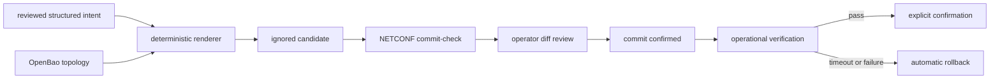
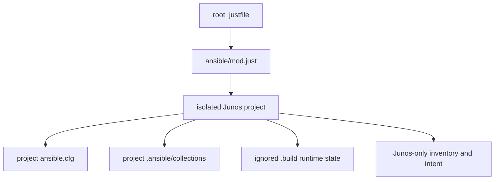
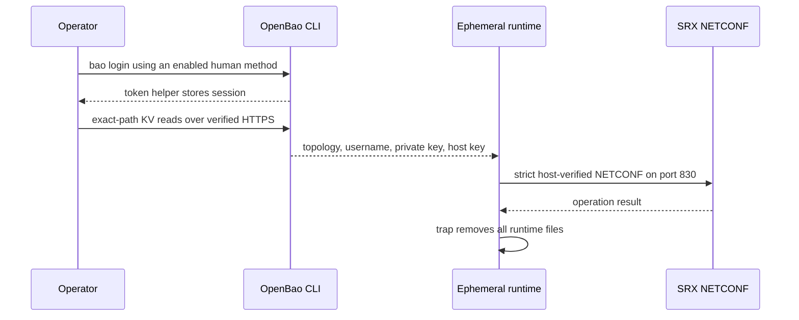

<div align="center">

# Junos SRX operator handbook


</div>

This project turns reviewed structured intent into a deterministic Junos candidate. OpenBao supplies real topology and NETCONF credentials; SOPS is not in the Junos secret path. Live changes use verified NETCONF, commit-check, explicit diff review, and commit-confirmed deployment.

## Contents

- [Architecture and ownership](#architecture-and-ownership)
- [Toolchain](#toolchain)
- [Controller and service prerequisites](#controller-and-service-prerequisites)
- [First-time setup](#first-time-setup)
- [OpenBao contract](#openbao-contract)
- [Structured intent](#structured-intent)
- [Command safety](#command-safety)
- [Operational runbooks](#operational-runbooks)
- [Troubleshooting](#troubleshooting)
- [Repository safety and handoff](#repository-safety-and-handoff)

## Architecture and ownership



The role owns only the `ANSIBLE_SRX1500` configuration group and its `apply-groups` reference. Device-local recovery users, authentication, unmanaged groups, and generated/default state remain outside its boundary.



### Runtime secret flow



The repository does not enable OpenBao auth methods, apply policy, write KV data, create tokens, rotate credentials, or manage the Docker service.

### Repository map

| Path | Purpose |
|---|---|
| `ansible.cfg` | Strict SSH, project-local collections, ignored controller temp paths |
| `inventory/` | One isolated Junos inventory; no environment hierarchy is needed for this device |
| `group_vars/junos/`, `host_vars/srx1500/` | Standard connection and identity controls; secrets arrive from OpenBao |
| `intent/srx1500/` | First-class seven-domain logical intent, not Ansible auto-loaded host variables |
| `roles/junos_intent/` | One coherent candidate renderer, identity gates, commit-check, and deployment lifecycle |
| `playbooks/` | Live, verification, confirmation, bounded drift, and backup workflows |
| `../requirements.yml` | Repository-wide exact Galaxy collection versions |
| `requirements-controller.in` and lock | Reviewed Python runtime and generated hashes |
| `scripts/` | Dispatch, OpenBao runtime, render, backup, and safety checks |
| `docker/c0/openbao/policies/junos-operator.hcl` | Sole deployable read-only OpenBao consumer policy |
| `.ansible/`, `.build/` | Ignored collections and protected transient candidates, diffs, summaries, and encrypted backups |

## Toolchain

| Component | Compatibility or reviewed version | Purpose |
|---|---:|---|
| mise | 2026.8.11 minimum | Tool activation and strict lock enforcement |
| Python | 3.13 | Controller runtime line |
| ansible-core | 2.21 | Deployment runtime line |
| juniper.device | 2.0.2 | Junos modules |
| ansible.netcommon | 8.6.1 | NETCONF connection support |
| junos-eznc | 2.8.2 | PyEZ runtime baseline |
| ncclient | 0.7.0 | Exact NETCONF transport required by junos-eznc 2.8.2 |
| jxmlease | 1.0.3 | Required legacy XML parser with a regression test |
| OpenBao CLI | 2.6.2 reviewed lock | KV consumer and session checks |
| age | 1.3.1 reviewed lock | Encrypted configuration backups |
| Gitleaks | 8.30.0 reviewed lock | Scanner accepted only after its canary succeeds |
| SRX / Junos | SRX1500 / `23.4R2` train | Live model and release gate |

`.mise.toml` selects compatibility lines; `mise.lock` owns exact artifacts, URLs, and checksums for macOS ARM64 and Linux x86-64. The ansible-core pipx environment receives a universal, hash-pinned controller requirements lock. Lint tools are isolated from that live environment. uv is only the resolver/installer used by mise and deliberate lock regeneration; it is not the workflow runner.

No global shell script duplicates every patch version. Preflight checks mise provenance, compatible release lines, imports, collection loading, and behavior. See [mise lockfiles](https://mise.jdx.dev/dev-tools/mise-lock.html), [mise pipx](https://mise.jdx.dev/dev-tools/backends/pipx.html), [Ansible support matrix](https://docs.ansible.com/projects/ansible/latest/reference_appendices/release_and_maintenance.html), and [Juniper requirements](https://github.com/Juniper/ansible-junos-stdlib).

## Controller and service prerequisites

The controller is Apple Silicon macOS, x86-64 Linux, or x86-64 WSL2 running the
repository from its Linux filesystem. It needs Bash, Git, `chmod`, `mktemp`, and
either `shasum` or `sha256sum`; mise supplies every version-sensitive
third-party CLI. Native Windows and WSL execution from `/mnt/c` are outside the
supported permission model.

Before a live command, all of these external prerequisites must already exist:

- DNS and a valid TLS chain for `vault.monosense.io`; use `BAO_CACERT` only if
  the service administrator supplies a private CA file. `BAO_SKIP_VERIFY`,
  `VAULT_SKIP_VERIFY`, and unreviewed TLS server-name overrides are prohibited
  and rejected before any OpenBao call.
- An enabled human OpenBao authentication method and a token with read access
  to the two exact KV v2 data paths. The repository does not create auth
  methods, policies, tokens, mounts, or Docker resources.
- A KV v2 engine mounted at `kv/`. An administrator can confirm the mount type
  and version with `bao secrets list -detailed` without reading Junos data.
- Network reachability from the trusted controller to the SRX NETCONF SSH
  service on TCP 830.
- An SRX1500 whose hostname is `srx1500` and whose release matches the anchored
  reviewed `23.4R2` train. Every live play rejects a different identity before commit.
- `system services netconf ssh` enabled and a dedicated, least-privilege Junos
  automation account with the matching SSH public key. Account and recovery
  configuration remain device-local and outside the managed group.
- The SRX SSH host public key verified through a trusted console or another
  independent administrative channel, plus an independent recovery path during
  deployment.

Juniper documents the required NETCONF service, account, and key setup in
[Establish an SSH connection for a NETCONF session](https://www.juniper.net/documentation/us/en/software/junos/netconf/topics/topic-map/netconf-ssh-connection.html).

## First-time setup

All steps through offline validation are locally testable on macOS, Linux, and WSL2. Live commands require network reachability to OpenBao and the SRX.

1. Install mise `v2026.8.11` from the
   [immutable official release](https://github.com/jdx/mise/releases/tag/v2026.8.11).
   Verify the archive against the release checksum and independently verify the
   signed release tag before putting the binary on `PATH`. This repository does
   not support Homebrew.
2. Trust and install the locked toolchain:

   ```console
   mise trust
   mise install --locked
   mise doctor
   ```

3. Install project-local Galaxy collections and run compatibility smoke tests:

   ```console
   just ansible junos bootstrap
   ```

4. Run secret-free validation:

   ```console
   just ansible junos test
   just ansible junos lint
   ```

5. Authenticate to the existing network OpenBao service using the human method already enabled by its administrator:

   ```console
   bao login
   bao token lookup
   ```

Root `.mise.toml` exports the public `BAO_ADDR=https://vault.monosense.io`
endpoint. The workflow uses the OpenBao CLI's token helper. It never reads,
exports, prints, or revokes the operator-owned token. TLS validation remains
enabled. If the service uses a private CA, configure the standard OpenBao CA
option; never use an insecure-skip flag. See
[OpenBao login](https://openbao.org/docs/commands/login/),
[token helpers](https://openbao.org/docs/commands/token-helper/), and
[TLS listener settings](https://openbao.org/docs/configuration/listener/tcp/).

## OpenBao contract

OpenBao runs outside this repository in Docker and is exposed at:

```text
https://vault.monosense.io
```

The Junos project is an OpenBao consumer. An OpenBao administrator must create
exactly two KV v2 records before any real render or device operation can run:

```text
kv/network/junos/srx1500/netconf
kv/network/junos/srx1500/topology
```

There is no `intent_secret`, SOPS document, local vars file, or lookup plugin.
The committed intent contains `{ topology: ... }` references. At runtime the
wrapper reads the `topology` record, resolves those references in memory, and
removes its temporary files on exit. The `netconf` record is used only to open
the authenticated NETCONF session; it is never rendered into Junos
configuration.

### What to store

The `netconf` record has exactly these fields:

| Field | Required value |
|---|---|
| `username` | Dedicated SRX automation account name; whitespace is rejected |
| `private_key` | Private key for that account, including its PEM/OpenSSH header and footer |

Password authentication is not implemented. The matching public key must
already be installed on the SRX automation account.

The `topology` record has this complete shape. The values below are reserved
documentation values that show types and nesting; replace every value with the
real environment value before writing OpenBao.

```json
{
  "management_address": "192.0.2.10",
  "system": {
    "domain": "example.invalid"
  },
  "dns": {
    "primary": "192.0.2.53",
    "secondary": "198.51.100.53",
    "internal": "192.0.2.53",
    "internal_cidr": "192.0.2.53/32"
  },
  "ntp": {
    "preferred": "192.0.2.123",
    "secondary": "198.51.100.123"
  },
  "wan": {
    "primary_mac": "02:00:00:00:00:01",
    "secondary_mac": "02:00:00:00:00:02"
  },
  "dhcp": {
    "option_138": "192.0.2.2"
  },
  "networks": {
    "mgmt": {
      "subnet": "192.0.2.0/27",
      "gateway": "192.0.2.1",
      "gateway_cidr": "192.0.2.1/27",
      "dhcp_low": "192.0.2.10",
      "dhcp_high": "192.0.2.20"
    },
    "prod": {
      "subnet": "198.51.100.0/27",
      "gateway": "198.51.100.1",
      "gateway_cidr": "198.51.100.1/27",
      "dhcp_low": "198.51.100.10",
      "dhcp_high": "198.51.100.20"
    },
    "home": {
      "subnet": "203.0.113.0/27",
      "gateway": "203.0.113.1",
      "gateway_cidr": "203.0.113.1/27",
      "dhcp_low": "203.0.113.10",
      "dhcp_high": "203.0.113.20"
    },
    "dev": {
      "subnet": "192.0.2.32/27",
      "gateway": "192.0.2.33",
      "gateway_cidr": "192.0.2.33/27",
      "dhcp_low": "192.0.2.40",
      "dhcp_high": "192.0.2.50"
    }
  },
  "reservations": {
    "mgmt": [],
    "prod": [
      {
        "name": "documentation-host",
        "mac": "02:00:00:00:00:10",
        "ip": "198.51.100.10"
      }
    ],
    "home": [],
    "dev": []
  },
  "netconf_host_key": {
    "type": "ssh-ed25519",
    "key": "BASE64_PUBLIC_HOST_KEY_WITHOUT_TYPE_OR_COMMENT"
  },
  "backup_age_recipient": "age1_public_recipient"
}
```

Each reservation requires `name`, `mac`, and `ip`; its IP must belong to that
pool's subnet. Reservation names, MAC addresses, and IP addresses must each be
unique across all pools. `netconf_host_key.key` is only the base64 key body;
`type` is one of `ssh-ed25519`, `ssh-rsa`, or the supported NIST ECDSA types.
`backup_age_recipient` is a public recipient, never an age private identity.

Topology is kept in OpenBao because it is environment-specific and sensitive,
even though not every field is cryptographic secret material. OpenBao must not
contain the operator's OpenBao token, an age private identity, SOPS keys, a
rendered candidate, a plaintext backup, or OpenBao server TLS private keys under
either Junos path.

### Create or update the records

Perform writes from an authorized administrator workstation, outside this
repository. Use `-mount=kv` so the KV v2 mount and logical path are unambiguous.
For the first NETCONF write, construct one protected JSON document outside the
repository. A trap removes the temporary document when the shell exits:

```bash
bao login

key_file=/secure/path/to/srx-automation-private-key
netconf_file="$(mktemp "${TMPDIR:-/tmp}/srx1500-netconf.XXXXXX.json")"
trap 'rm -f -- "$netconf_file"' EXIT HUP INT TERM
jq -n \
  --arg username 'REPLACE_WITH_AUTOMATION_USERNAME' \
  --rawfile private_key "$key_file" \
  '{username: $username, private_key: $private_key}' >"$netconf_file"
chmod 0600 "$netconf_file"
bao kv put -mount=kv -cas=0 network/junos/srx1500/netconf @"$netconf_file"
rm -f -- "$netconf_file"
trap - EXIT HUP INT TERM
unset key_file netconf_file
```

Create the topology as JSON in a mode-`0600` temporary file outside the Git
checkout, replace every documentation value, and write it as one JSON object:

```bash
topology_file=/secure/path/outside-the-repository/srx1500-topology.json
chmod 0600 "$topology_file"
bao kv put -mount=kv -cas=0 network/junos/srx1500/topology @"$topology_file"
```

`-cas=0` deliberately fails if the record already exists. This prevents an
initialization command from overwriting live data. For an intentional update,
read only the current metadata version and supply it to `-cas`; the update then
fails if another administrator changed the record concurrently:

```bash
current_version="$({ bao kv metadata get -mount=kv -format=json network/junos/srx1500/topology; } \
  | jq -er '.data.current_version')"
bao kv put -mount=kv -cas="$current_version" \
  network/junos/srx1500/topology @"$topology_file"
unset current_version
```

Use the same compare-and-set procedure for the NETCONF record. Delete any
temporary source file after the write according to the workstation's secure
deletion policy. OpenBao KV v2 retains versions according to the mount's
administrator-owned retention policy; ordinary consumers cannot purge history.
See [KV v2 versioning and policies](https://openbao.org/docs/secrets/kv/kv-v2/)
and [`bao kv put` JSON input and CAS](https://openbao.org/docs/commands/kv/put/).

### Verify access without displaying values

Do not use a plain `bao kv get` during routine verification because it prints
the secret. These checks validate the record shape while discarding all output:

```bash
bao kv get -mount=kv -format=json network/junos/srx1500/netconf \
  | jq -e '
      .data.data as $v
      | ($v | keys | sort) == ["private_key", "username"]
      and ($v.username | type == "string" and length > 0)
      and ($v.private_key | type == "string"
           and startswith("-----BEGIN"))
    ' >/dev/null

bao kv get -mount=kv -format=json network/junos/srx1500/topology \
  | jq -e '
      .data.data as $v
      | ($v.management_address | type == "string" and length > 0)
      and ($v.dns | type == "object")
      and ($v.ntp | type == "object")
      and ($v.wan | type == "object")
      and ($v.networks | type == "object")
      and ($v.reservations | type == "object")
      and ($v.netconf_host_key | type == "object")
      and ($v.backup_age_recipient | type == "string")
    ' >/dev/null
```

Then run `just ansible junos render`. It performs the repository's complete
topology resolution and validation without contacting the SRX. A live command
also validates and loads the NETCONF record before opening a device session.

### Access policy and rotation

The automation consumer needs only `read` on these KV v2 API paths:

```text
kv/data/network/junos/srx1500/netconf
kv/data/network/junos/srx1500/topology
```

The exact consumer contract is maintained at
`docker/c0/openbao/policies/junos-operator.hcl`, the sole deployable policy
source. It grants only `read` on these two data paths; this repository does
not apply it. An administrator who creates or updates data separately needs
`create` and `update` on the two `/data/` paths and `read` on the corresponding
`/metadata/` paths to use CAS. Do not grant write or delete capabilities to the
Ansible consumer. KV v2 policy paths include `/data/`, although CLI logical
paths do not.

Rotate a NETCONF key in this order: install the new public key on the SRX, write
the new private key to OpenBao with CAS, run `check`, and only then remove the
old public key. For a host-key change, independently verify the new SRX host key
before updating `netconf_host_key`; never learn it with trust-on-first-use. For
backup-recipient rotation, prove that the offline recovery identity can decrypt
a test artifact before updating the public recipient.

### Runtime fetch and injection

After `bao login`, a real command performs these steps automatically:

1. `bao token lookup` verifies the existing human session.
2. `bao kv get -mount=kv -format=json network/junos/srx1500/topology` supplies
   topology references, management address, pinned host key, and backup
   recipient.
3. Live device actions additionally read
   `network/junos/srx1500/netconf` for the username and private key.
4. A mode-`0700` temporary directory receives mode-`0600` runtime files. The
   wrapper exports only file paths and connection values to Ansible.
5. A trap removes the response documents, key, known-hosts file, SSH config,
   and resolved topology when the process exits.

The host key is authoritative. Each live invocation writes an ephemeral
`[host]:830` known-host entry and SSH configuration with strict checking. Do not
replace this with `ssh-keyscan` or trust-on-first-use. See
[Ansible NETCONF connection options](https://docs.ansible.com/projects/ansible/latest/collections/ansible/netcommon/netconf_connection.html).

The age recipient is public and belongs to an offline recovery identity. Its
private identity is never stored in OpenBao, Git, CI, or an ordinary
workstation. See [SOPS and age](../../docs/SOPS.md).
Reviewed intent is split into seven first-class domain files under
`intent/srx1500/`: `system.yml`, `interfaces.yml`, `vlans.yml`, `dhcp.yml`,
`routing.yml`, `nat.yml`, and `security.yml`. The previous nested convention
`host_vars/srx1500/intent/` is intentionally absent; Ansible does not
auto-load structured intent as host variables.

The renderer resolves environment-specific `{ topology: ... }` references
from OpenBao in memory. DNS nameservers use `dns.primary`/`dns.secondary`;
client DHCP and the global `MGMT-DNS` address-book use the dedicated
`dns.internal`/`dns.internal_cidr` fields. A `dns.blocky` substitution is
rejected, so the production resolver cannot silently become the Docker DNS
proxy. The renderer validates every VLAN, IRB, interface/unit, routing,
zone, NAT, DHCP, reservation, policy, and ordered-term relationship before
emitting only the `ANSIBLE_SRX1500` apply-group.

The running-config reconciliation preserves the live `VR-XLSATU` HOME
routing/DHCP relationship, four independent source-NAT rule sets, five RSTP
point-to-point trunks with bridge priority, all explicit permit/deny policy
ordering and logging, WAN screens, DHCP option 138, and the `TO-C0-TRUNK`
native VLAN 2510 plus tagged VLAN-DEV (2513) invariant. Recovery users and
authentication remain device-local.

## Migration and adoption boundary

The reviewed running configuration currently has no `ANSIBLE_SRX1500` group or
`apply-groups` reference. This implementation therefore has a deliberate
no-live gate: offline render, tests, and syntax checks remain usable, while
`deploy` and pre-adoption drift analysis fail closed. No direct cleanup,
adoption command, or live mutation is part of this change.

The gate is the tracked `adoption.yml` record, read directly by the role,
drift playbook, and live wrapper; it is deliberately `adopted: false`. Ansible
extra vars cannot override this decision, and no command in this repository
mutates the record. A separately reviewed maintenance procedure must update
that tracked record only after all parity evidence is accepted.

The migration sequence for a separately approved maintenance window is:

1. Capture an allowlisted managed-scope baseline and independently verify
   recovery access.
2. Compare direct configuration with the rendered group semantically, keeping
   login, root authentication, and other recovery ownership device-local.
3. Atomically remove only approved direct managed hierarchies, load the group
   and `apply-groups`, run commit-check and a commit-confirmed transaction,
   then verify effective parity and confirm explicitly.
4. Review and commit the adoption record change separately; there is no
   deployment or adoption mutation command here.

Until then, a normal deploy cannot be accidentally enabled by a caller. The
drift workflow retrieves only the managed group and apply-groups reference,
normalizes them in memory, and writes a bounded count/value-free path summary;
it never writes a whole-device configuration or performs unsafe direct-shadow
claims.


## Command safety

| Command | Offline/live | Reads device | Modifies candidate | Commits | Confirmation | Sensitive output |
|---|---|---:|---:|---:|---:|---:|
| `just ansible junos bootstrap` | Offline* | No | No | No | No | No |
| `just ansible junos test` | Offline | No | No | No | No | No |
| `just ansible junos lint` | Offline | No | No | No | No | No |
| `just ansible junos render` | OpenBao live | No | No | No | No | Suppressed candidate |
| `just ansible junos check` | Live | Yes | Temporary | No | No | Suppressed |
| `just ansible junos diff` | Live | Yes | Temporary | No | No | Reviewed local diff |
| `just ansible junos deploy` | Live | Yes | Yes | Confirmed | Yes | Candidate/diff |
| `just ansible junos verify` | Live | Yes | No | Confirms pending | Yes | Suppressed |
| `just ansible junos drift` | Live after adoption | Yes (managed scope only) | No | No | No | Bounded path/count summary |
| `just ansible junos backup` | Live | Yes | No | No | No | Age ciphertext |

`*` Bootstrap may download tools or collections but never accesses OpenBao or the SRX.

## Operational runbooks

### Offline lint, test, and synthetic render

```console
just ansible junos bootstrap
just ansible junos test
just ansible junos lint
```

`test` renders the synthetic fixture twice and compares SHA-256 digests. It also tests ordering, duplicate prevention, subnet validation, ownership, and password-hash exclusion.

### Render real topology

After `bao login`:

```console
just ansible junos render
```

This reads only topology, does not contact the device, and writes the candidate under ignored `.build/`. Ephemeral topology is removed when the command exits.

### Commit-check and diff

```console
just ansible junos check
just ansible junos diff
```

The runtime proves compatibility, reads both exact OpenBao paths, establishes strict host trust, verifies SRX1500 and the anchored `23.4R2` train, loads the candidate in normal Ansible mode with `check_commit: true`, and discards the uncommitted candidate after NETCONF validation. `diff` additionally requires prepared module diff evidence whenever Junos reports a change; a missing prepared diff fails closed. Review the entire ignored diff. Stop if it touches device-local authentication, anything outside `ANSIBLE_SRX1500`, or unexplained topology.


```console
just ansible junos deploy
```

The command renders and validates the exact candidate first, displays its digest, and requires the exact hostname/digest phrase. Only after successful validation does it perform a ten-minute commit-confirmed transaction. Keep the terminal and an independent management path available.

### Verification, confirmation, and rollback

Before the timer expires:

```console
just ansible junos verify
```

Verification checks the newest pending commit comment, managed-group identity, and structured operational evidence against the exact candidate digest. It requires a second digest-specific confirmation immediately before the final commit. If verification fails, the command is interrupted, or confirmation is withheld, do not manually confirm; Junos automatically rolls back. See [Junos confirmed commits](https://www.juniper.net/documentation/us/en/software/junos/cli/topics/topic-map/junos-configuration-commit.html).

### Drift

```console
just ansible junos drift
```

The command is fail-closed before adoption. After migration, it retrieves
only `ANSIBLE_SRX1500` and its `apply-groups` reference, compares normalized
managed lines in memory, and writes a bounded count/path summary under
ignored `.build/`; it never persists effective whole-device configuration.

### Encrypted backup

```console
just ansible junos backup
```

Committed configuration is held only in process memory and streamed to mise-managed age. The only persistent result is:

```text
.build/backups/srx1500-<UTC timestamp>.conf.age
```

Incomplete ciphertext is removed on error or interruption. Transfer valid ciphertext to approved storage. Decryption requires the offline recovery identity described in [SOPS and age](../../docs/SOPS.md).

## Troubleshooting

| Failure | Diagnosis and corrective action |
|---|---|
| Mise missing or untrusted | Install the verified release, run `mise trust`, then `mise install --locked`. |
| Lock mismatch | Never bypass locked mode; regenerate and review the lock for both platforms. |
| Tool outside mise | Activate mise and remove ambient PATH precedence; package-manager and project-virtualenv paths are rejected. |
| Python/pipx import failure | Regenerate the universal hash lock with mise-managed uv, reinstall, and rerun bootstrap. |
| Galaxy module missing | Rerun bootstrap; collections belong only under `.ansible/collections`. |
| `bao token lookup` fails | Run `bao login` with an enabled human auth method and inspect the token helper. |
| OpenBao DNS/TLS failure | Verify DNS, time, certificate chain, and legitimate CA configuration; never disable validation. |
| KV permission denied | Compare token policy with the two exact `/data/` paths. |
| KV schema rejected | Correct the username, OpenSSH key, topology, host key, or age recipient at the source. |
| SSH host-key mismatch | Stop; independently verify the SRX key before an administrator updates OpenBao. |
| NETCONF unavailable | Verify port 830, NETCONF service, routing, policy, account public key, and session limits. |
| Wrong model/release | Stop; live workflows permit only SRX1500 on reviewed `23.4R2`. |
| Candidate lock/check failure | Inspect device sessions and diagnostics; never force around the guard. |
| Confirmed commit rolled back | Treat rollback as containment, collect evidence, correct intent, and restart at check. |
| Backup encryption fails | Incomplete output is removed; validate the public recipient and age provenance. |

## Repository safety and handoff

Before every push:

- Run bootstrap, test, lint, and the Gitleaks workflow.
- Confirm no token, private key, topology response, runtime host file, plaintext backup, candidate, diff, or drift evidence is tracked.
- Confirm the fixture contains documentation-only values.
- Confirm workflows are read-only, GitHub-hosted, and SHA-pinned.
- Confirm no SOPS lookup, legacy local credential workflow, password authentication, or insecure TLS option has returned.

Handoff records the intent commit, candidate digest, deployment/confirmation time, Junos release, encrypted-backup location, and operator—never secret values or private topology.
