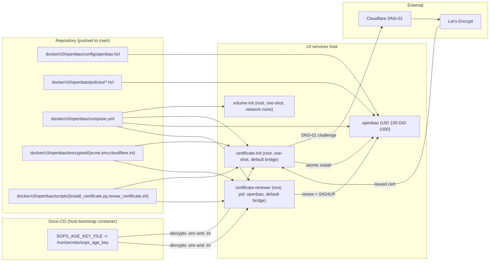

# OpenBao on c0

OpenBao is the first Doco-CD-managed core service deployed on the c0 services
host. This document is its authoritative index: it states the purpose,
enumerates every component, names the files that define each contract, and
points at the runbooks that own day-2 operations. Procedures, recovery
scripts, and bootstrap commands live in the linked runbooks, not here.

For SOPS/age conventions and recipient custody, see [SOPS.md](SOPS.md).

## Purpose and scope

OpenBao holds the small set of runtime secrets that no other system should
ever contain in plaintext: Junos NETCONF credentials and SRX1500 topology,
future operator userpass verifiers, and similar infrastructure material. The
service:

- Exposes a single-node Raft cluster with public TLS at
  `https://vault.monosense.io:8200`.
- Issues and renews its own certificate through Let's Encrypt DNS-01
  challenges published to Cloudflare from inside containers; no in-host
  ACME client exists.
- Stays reachable only via the static SERVICES address `10.25.13.34` on the
  external `c0_services` Docker network; no host port mapping is published.
- Stores no application secrets in this repository; encrypted SOPS inputs
  under `docker/c0/openbao/encrypted/` hold only the Cloudflare DNS-01 token
  and the ACME account email.

Scope is intentionally narrow. PowerDNS Authoritative is deployed independently at
`10.25.13.33`; OpenBao does not depend on it. No native observability agent or cAdvisor is
installed on c0. Adding resolver forwarding or observability must not weaken the static-address
and no-host-port model.

## Component and data flow

The control plane is Git → Doco-CD → Compose. The data plane is OpenBao
Raft storage plus an encrypted ACME staging/production cycle that publishes
to Cloudflare through a restricted token.

## Filesystem and identity matrix

| Path                                        | Owner         | Mode   | Purpose                                                       |
| ------------------------------------------- | ------------- | ------ | ------------------------------------------------------------- |
| `docker/c0/openbao/compose.yml`             | repository    | 0644   | Four-service project, three named volumes, external `c0_services` |
| `docker/c0/openbao/.doco-cd.yaml`           | repository    | 0644   | Doco-CD project name `openbao-c0`                             |
| `docker/c0/openbao/config/openbao.hcl`      | repository    | 0644   | TLS listener, Raft storage, stdout audit                      |
| `docker/c0/openbao/policies/admin.hcl`      | repository    | 0644   | Named-administrator policy (full root, `sudo`)                |
| `docker/c0/openbao/policies/junos-operator.hcl` | repository | 0644   | Least-privilege Junos consumer policy                         |
| `docker/c0/openbao/scripts/install_certificate.py` | repository | 0755 | TLS validation, atomic install, rollback, expiry check        |
| `docker/c0/openbao/scripts/renew_certificate.sh`  | repository | 0755 | Serialized renew/dry-run loop                                 |
| `docker/c0/openbao/tests/test_install_certificate.py` | repository | 0644 | Unit suite, run inside the pinned Certbot image               |
| `docker/c0/openbao/encrypted/acme.env`      | repository    | 0644   | SOPS-encrypted `.env` (single `ACME_EMAIL` key)               |
| `docker/c0/openbao/encrypted/cloudflare.ini`| repository    | 0644   | SOPS-encrypted `.ini` (single `dns_cloudflare_api_token` key) |
| `.sops.yaml`                                | repository    | 0644   | Three-recipient creation rule scoped to `docker/c0/.../encrypted/` |
| `docker/c0/.doco-cd/docker-compose.app.yaml` | host (`/opt/doco-cd/compose.yml`) | 0644 | Doco-CD container with `SOPS_AGE_KEY_FILE` env literal |
| `/opt/doco-cd/secrets/api_secret`           | `root:root`   | 0600   | Doco-CD API secret (unchanged from existing deployment)       |
| `/opt/doco-cd/secrets/sops_age_key`         | `root:root`   | 0600   | Dedicated c0 Doco-CD age identity, never written to workstation storage |
| `openbao-data` (named volume root)          | `100:1000`    | 0700   | Raft storage path `/openbao/data`                             |
| `openbao-acme` (named volume root)          | root          | 0755   | `/etc/letsencrypt` lineage tree                               |
| `openbao-tls` (named volume root)           | `root:root`   | 0755   | Container root directory; `releases/` and each `releases/<serial>/` are `root:root` mode `0755` |
| `openbao-tls/releases/<serial>/fullchain.pem` | `100:1000` | 0644   | Published certificate for the generation                     |
| `openbao-tls/releases/<serial>/privkey.pem`   | `100:1000` | 0600   | Published private key for the generation                     |
| `openbao-tls/current`, `openbao-tls/previous` | `root:root` | n/a (symlink) | Root-owned relative symlinks pointing into `releases/<serial>/`; symlink permissions are not the security boundary |
| `/run/certbot/cloudflare.ini` (tmpfs copy)  | root          | 0600   | Runtime-only copy used by Certbot; removed on trap exit       |
| Doco-CD decrypted ciphertext (in-place on existing Git files) | root          | 0644   | Preserved by Doco v0.111 on the existing tracked file; reachable only via `/var/lib/docker` which is `root:root` mode `0710` |

No private key, token, password, ACME email, certificate serial, share, or
backup checksum appears in this document or anywhere else in Git.

## Services

The project `openbao-c0` defines exactly four services in
`docker/c0/openbao/compose.yml`. Container IDs are resolved through Compose
labels `com.docker.compose.project=openbao-c0` and
`com.docker.compose.service=<service>`; generated container names are
never assumed.

### `volume-init`

One-shot container using the pinned OpenBao image as `root:root` with
`network_mode: none`, all capabilities dropped except `CHOWN`. Its only
job is to create `/openbao/data` inside `openbao-data`, run the explicit
sequence `chown 0:0`, `chmod 0700`, then `chown 100:1000`, so the final
mount is owned by the non-root server user with mode `0700` and no other
container has write access into it.

### `certificate-init`

One-shot container using the pinned Certbot image as `root`, attached only
to the default bridge. It receives `encrypted/acme.env` as `env_file` and
`encrypted/cloudflare.ini` as a Compose secret mounted at
`/run/secrets/cloudflare.ini`. Source mode is asserted group/world-clean
before the file is copied to a `mode=0700` tmpfs path with `install -m 0600`,
then the runtime copy is the only file Certbot ever sees and is removed by
an `EXIT HUP INT TERM` trap. OpenBao is not running yet, so `--reload-pid`
is omitted; the installer's `install` subcommand performs the atomic switch
into `openbao-tls/current/`. This service does not join `c0_services`.

### `openbao`

The long-running server. Pinned image, `user: "100:1000"`, command
`server`, all capabilities dropped, `no-new-privileges:true`,
`mem_swappiness: 0`, `restart: unless-stopped`. The static
`BAO_ADDR=https://vault.monosense.io:8200` advertises the public client
URL, and `extra_hosts` binds `vault.monosense.io` to `10.25.13.34` so
the pre-resolver-cutover path works without modifying the workstation or c0 host resolver. Only
this service attaches to `c0_services` at `10.25.13.34`.
Its healthcheck runs `bao status` and accepts documented exit codes `0`
(unsealed) and `2` (sealed), reflecting that the first uninitialized
response must not be treated as failure; `/v1/sys/health` HTTP
`501/503/200` remains the authoritative readiness signal.

### `certificate-renewer`

Long-running container that shares the OpenBao PID namespace via
`pid: service:openbao` so a `SIGHUP` sent to the OpenBao server
process (a descendant of dumb-init's PID 1) reaches the server
process after a successful symlink switch. It runs on the default bridge
(not `c0_services`), depends on `certificate-init` completing and
`openbao` starting. The shell loop invokes `renew_certificate.sh renew`
every 12 hours, logs failure, sleeps through a tracked child process so
an external signal produces a prompt shutdown, and runs the installer's
`check` subcommand as its healthcheck with a 21-day validity floor. The
renewer holds a process-local lock at `/run/certbot/renew.lock` so
dry-runs serialize against production runs.

## Volumes

Three named volumes with engine-level names. None are anonymous, and none
are removed by the documented destructive path on failure.

| Volume         | Backing | Consumer(s)                                              | Mount path        |
| -------------- | ------- | -------------------------------------------------------- | ----------------- |
| `openbao-data` | local   | `volume-init`, `openbao`                                 | `/openbao/data`   |
| `openbao-acme` | local   | `certificate-init`, `certificate-renewer`                | `/etc/letsencrypt`|
| `openbao-tls`  | local   | `certificate-init` (rw), `openbao` (ro), `certificate-renewer` (rw) | `/openbao/tls`    |

`openbao-data` is owned `100:1000` mode `0700` after `volume-init`; the
OpenBao process reads it as UID 100. `openbao-tls` is `root:root` mode
`0755` at the top level; the installer maintains `releases/` and each
`releases/<serial>/` as `root:root` mode `0755`, with `fullchain.pem`
written mode `0644` and `privkey.pem` mode `0600` owned `100:1000`.
It maintains the root-owned relative symlinks `current` and `previous`
pointing into `releases/<serial>/`. Symlink permissions are not the
security boundary; the access boundary is the containing directory.
The installer's atomic rename guarantees that `current` either points
at the previous validated generation or at a new fully-written
generation. `openbao-acme` is the Certbot lineage tree.

## Network, TLS, and Raft identity

- External network: `c0_services` (`10.25.13.0/24`, gateway
  `10.25.13.1`). Only `openbao` joins it; the three other services run on
  `none` or the default bridge. Static address: `10.25.13.34`.
- No host port mapping. `docker port <openbao-c0-openbao-id>` returns an
  empty list. Public DNS for `vault.monosense.io` is intentionally absent. PowerDNS Authoritative
  serves the private record at `10.25.13.33`, but AdGuard does not forward to it; workstation and
  c1 OpenBao procedures therefore continue using
  `--resolve vault.monosense.io:8200:10.25.13.34`.
- Listener (`config/openbao.hcl`):
    - `address = "0.0.0.0:8200"` (client), `cluster_address =
      "0.0.0.0:8201"` (cluster)
    - `tls_disable = false`, `tls_min_version = "tls12"`
    - Certificate and key loaded from
      `/openbao/tls/current/{fullchain,privkey}.pem`
- API and cluster addresses:
    - `api_addr = "https://vault.monosense.io:8200"`
    - `cluster_addr = "https://10.25.13.34:8201"`
- Raft storage: `path = "/openbao/data"`, `node_id = "c0-openbao-1"`.
  Cluster traffic uses OpenBao's internal cluster TLS on the trusted
  `c0_services` network; the production `tls_cert_file` is for client
  traffic only and is not applied to cluster addresses.
- Audit: declarative `audit "file" "stdout"` with `file_path = "stdout"`,
  description `Write audit information to standard output.`. Raw logging
  is disabled.
- Restore scratch HCL: snapshots do not contain listener or audit
  configuration. The destructive restore test on an isolated c1 instance
  uses HTTP loopback (`api_addr = "http://127.0.0.1:8200"`, listener on
  `0.0.0.0:8200` with `tls_disable = true`) and a separately reasserted
  audit/listener block; the production `https://vault.monosense.io:8200`
  address is not used during restore proof.

## Security and credential ownership matrix

| Material                                  | Storage                                       | Custody                                                       |
| ----------------------------------------- | --------------------------------------------- | ------------------------------------------------------------- |
| Workstation developer age identity        | `~/.config/sops/age/keys.txt`                 | Developer account, mode `0600`, never in Git                  |
| c0 Doco-CD age identity                   | `/opt/doco-cd/secrets/sops_age_key`           | Root-only on c0, mode `0600`; installed via SSH pipe from `age-keygen` |
| Hermes recovery age identity             | Hermes `~/.config/sops/age/keys.txt`          | Sole dedicated recovery-key host, mode `0600`; developer workstation, c0, c1, and CI do not receive it |
| SOPS ciphertext                           | `docker/c0/openbao/encrypted/{acme.env,cloudflare.ini}` | Git, decryptable by any of the three recipients                |
| Doco-CD decrypted ciphertext (existing files in working clone) | Doco-CD data volume on c0  | Mode `0644` preserved by Doco v0.111; reachable only via `/var/lib/docker` which is `root:root` mode `0710` |
| ACME account email                        | Decrypted `acme.env` only                     | Operator mailbox, never logged                                |
| Cloudflare API token                      | Decrypted `cloudflare.ini` only               | Restricted to `Zone:DNS:Edit` on `monosense.io`; runtime copy mode `0600` on tmpfs |
| Doco-CD API secret                        | `/opt/doco-cd/secrets/api_secret`             | Root-only on c0, unchanged from existing deployment           |
| OpenBao Shamir shares                     | Offline media (operator custody)              | Three shares, threshold two; never in Git, SOPS, logs, or chat |
| OpenBao userpass passwords                | Operator password manager / offline custody   | Plaintext retained off-host only; OpenBao retains only the verifier and never the password |
| OpenBao Raft snapshot                     | `$HOME/.local/share/openbao-backups/c0/*.snap.age` on operator workstation | Encrypted with developer and Hermes recovery recipients; copied to Hermes |

The matrix is enforced by the repository's `.sops.yaml` creation rule and
the `docker/c0/[^/]+/encrypted/.*` path scope. CI receives no age identity
and performs no decryption.

### Kernel and platform facts

- The c0 host keeps Docker under `/var/lib/docker` with mode `0710`,
  owned `root:root`. That ownership boundary is what protects the
  `doco-cd-data` and `openbao-data` volumes from non-root inspection.
- Doco v0.111 decrypts SOPS inputs in place over the existing Git
  file; the observed and runtime mode is `0644`. Only the runtime
  tmpfs credential copy used by Certbot (`/run/certbot/cloudflare.ini`)
  is mode `0600`. In every case access is gated by the
  `/var/lib/docker` boundary above. This accepted plaintext-at-rest
  boundary is the reason c0 and Docker remain a trusted compute base.
- The c0 kernel discards per-container `mem_swappiness`; the OpenBao
  service sets `mem_swappiness: 0` explicitly as a declarative record of
  intent rather than relying on host swap configuration.
- `c0_services` is an external Docker network created out-of-band; the
  project declares it as `external: true` and never recreates it.
- Recovery identity custody is on the dedicated recovery host Hermes. The former c1 recipient was
  removed from current ciphertext only after Hermes decrypted a SOPS canary and an actual rekeyed
  repository ciphertext. The obsolete c1 private identity was then deleted; historical Git
  ciphertext may still name that former recipient.

## Recovery and dependency model

Recovery has three independent layers. Each is an alternative path; they
do not all have to succeed for the system to recover.

- **Workstation developer identity.** Recovers ciphertext authored from
  the workstation. Used during normal operation and during any change
  authored by the workstation.
- **c0 Doco-CD identity.** Lives only at
  `/opt/doco-cd/secrets/sops_age_key`. Allows the host-bootstrap Doco-CD
  container to decrypt SOPS inputs and apply Compose configuration to c0.
  This identity never exists on the workstation, in Git, or in chat.
- **Hermes recovery identity.** Resident only on the dedicated always-online Hermes host. Its
  private half never reaches the workstation, c0, c1, or CI; its public recipient in `.sops.yaml`
  allows ciphertext to be opened without contacting the developer or deployed host. No
  removable-media copy or attached external storage is required.

Doco-CD remains recoverable without OpenBao. The Doco container does not
contact OpenBao, has no OpenBao policy, and mounts no OpenBao volume.
SOPS with age is the permanent deployment-secret path; OpenBao does not
replace it.

OpenBao depends on:

1. Docker Engine 29.7.2 and Compose 5.5.0 on c0 (amd64).
2. The external `c0_services` network with `10.25.13.34` free.
3. The named volumes `openbao-data`, `openbao-acme`, `openbao-tls` not
   in conflicting use.
4. A reachable path to `10.25.13.34:8200` for any caller. PowerDNS serves the private record
   directly, but AdGuard forwarding is not configured; callers use
   `--resolve vault.monosense.io:8200:10.25.13.34`. Public DNS remains intentionally absent.
5. The Cloudflare DNS zone for `monosense.io` delegated to the operator
   account, with a token scoped to `Zone:DNS:Edit`.

OpenBao does not depend on cAdvisor, a native observability agent, or any
c1-resident service.

## Private DNS publication gate

PowerDNS deployment was prohibited until every completion check below passed. The deployed private
zone now contains `vault.monosense.io -> 10.25.13.34`, but client resolvers are unchanged and
`--resolve` remains the OpenBao runbook path until a separate AdGuard cutover is reviewed.

OpenBao is complete only when all of the following hold:

- SOPS runtime decryption of `acme.env` and `cloudflare.ini` from
  Doco-CD; CI never receives an age identity.
- ACME staging and production issuance through Cloudflare DNS-01 inside
  `certificate-init`.
- `renew_certificate.sh` dry-run succeeds against Cloudflare without
  touching production TLS.
- Shamir initialization with three shares and threshold two; two
  distinct shares manually entered to transition `503 -> 200`.
- Named userpass identities `monosense-admin` (full admin) and
  `monosense-junos` (read-only on the two exact Junos paths in
  `policies/junos-operator.hcl`).
- Initial root token self-revoked; no token-helper file remains; both
  named identities still authenticate; OpenBao retains only the
  verifier, never the password.
- Audit `file/stdout` records login, policy, mount, denial, and
  root-token revocation without raw secrets.
- Encrypted off-host Raft snapshot at
  `$HOME/.local/share/openbao-backups/c0/*.snap.age`, decryptable by
  both developer and offline identities; destructive isolated restore
  proof on c1 with `monosense-admin` able to retrieve the recovery
  sentinel.
- Controlled c0 reboot returns OpenBao sealed `503` and accepts two
  shares to reach active `200`; Doco-CD, OpenBao, and
  `certificate-renewer` auto-restart; volumes and current certificate
  persist.

PowerDNS deployment began only after every item above passed and did not migrate Doco-CD away from
SOPS/age.

## Operational runbooks

Day-2 operations, bootstrap, and recovery each have their own document.
OpenBao's architecture and contracts live here; the procedures live
there.

- [Bootstrap](openbao/BOOTSTRAP.md) — Doco-CD installation, the
  `/opt/doco-cd/secrets/sops_age_key` install pipeline, first
  `openbao-c0` deployment, and one-time `bao operator init` plus
  userpass provisioning.
- [Operations](openbao/OPERATIONS.md) — `bao status` checks, unseal
  from the manual share set, certificate expiry inspection, renewer log
  triage, and destructive Doco project removal on failure.
- [Backup and restore](openbao/BACKUP-RESTORE.md) — `bao operator raft
  snapshot` streaming, workstation
  `$HOME/.local/share/openbao-backups/c0/` artifact lifecycle, and the
  isolated c1 destructive-restore proof.
- [SOPS and age](SOPS.md) — repository-wide workstation identity
  convention, recipient custody, and `sops updatekeys` / `sops rotate`
  maintenance.
